# Wazuh 5 architecture and comparison with the current Helm deployment

Wazuh 5 keeps the main roles of endpoint agents, a manager cluster, an indexer
and a dashboard, while changing the communication, initialization and storage
contracts between them. This document introduces those changes first, explains
the Wazuh 4 deployment we have today, and maps the differences to this Helm chart.

The comparison uses the pinned **5.0.0-rc1** upstream sources inspected on
**8 October 2026**. It describes a compatibility target; Wazuh 5 is not deployed
or supported by the current chart. RC behavior can change before general
availability. The current chart is **2.0.7**, with **Wazuh 4.14.3** manager,
indexer and dashboard images and the third-party **4.14.1** agent image.

For printing, use the [A4 PDF](architecture-2-print.pdf) or download the
[standalone HTML](architecture-2-print.html). Every diagram has a fixed white
background. The [original architecture document](architecture.md) provides
additional detail about the existing chart's optional features.

## 1. Introducing the Wazuh 5 architecture

**Agents** collect endpoint events and connect to the manager through HTTPS on
**1517**. For new enrollment, an operator or automation requests an enrollment
token from the manager API on **55000**. The token can contain the manager
endpoint and its CA trust. The agent uses the token to enroll through the same
1517 endpoint that subsequently carries its events.

**The manager cluster** receives and processes events. A master provides the
management API and cluster coordination, while workers provide additional
processing capacity. The new manager runtime uses `/var/wazuh-manager` and
`wazuh-manager.conf`. Its manager/indexer integration needs new configuration;
our existing Filebeat mounts and settings cannot simply be reused.

**The indexer** stores and serves searchable security data. Upstream also
describes managers downloading detection content from it, including ruleset,
IOC content and engine state. This creates a dependency on both indexer
availability and the manager's persisted detection-content directory.

**The dashboard** queries the indexer and calls the master management API using
separate service identities. Its keystore holds backend credentials and an AI
assistant encryption key. Those files need to survive pod recreation.

The Kubernetes packaging should retain the familiar workload types: manager
and indexer StatefulSets, a dashboard Deployment, and a compatible agent
DaemonSet where appropriate. That is our proposed Helm design, not a claim that
the inspected upstream deployment examples are this chart.

The supporting resources become part of the migration:

This diagram shows dependencies rather than exact Secret/PVC names. Each
component receives only its required credentials. Manager API HTTPS and the
1517 agent listener are separate endpoints; a listener certificate does not
automatically configure API trust. Agent identity also needs persistent storage
on the endpoint or node running the agent.

## 2. The major Wazuh 5 changes

### Agent transport and enrollment

Wazuh 4 separates agent events on **1514** from conventional authd enrollment
on **1515**. Wazuh 5 agents use **HTTPS 1517** for both enrollment and events,
with **API-issued enrollment tokens** instead of the old password-based
registration settings. The enrollment endpoint must match the certificate's
Subject Alternative Names, and the agent needs the appropriate CA trust.

The upstream manager Dockerfile retains 1514/1515 for legacy Wazuh 4 agents.
That establishes an intended legacy path in those images, but does not prove
compatibility for our current agent image, chart configuration or deployment.
New-agent enrollment and legacy-agent behavior need separate tests.

### Manager runtime and indexing

Manager paths change from `/var/ossec` to `/var/wazuh-manager`; `ossec.conf`
becomes `wazuh-manager.conf`, and the control command becomes
`wazuh-manager-control`. The manager service user also changes to
`wazuh-manager`. These changes affect configuration generation, volume mounts,
ownership, probes, lifecycle commands and diagnostic scripts.

The inspected RC uses changed manager/indexer configuration. We must replace
the chart's assumptions about the Wazuh 4 Filebeat pipeline, then verify alert,
archive and inventory behavior with real events. We have not measured Wazuh 5
throughput, latency or resource use, so this document makes no performance claim.

### Credentials and first-start behavior

Upstream images ship no passwords. Each component receives a credential file
at `/run/secrets/wazuh-credentials` and stores the required values in its account
database, security configuration or keystore during first initialization.
Changing the Kubernetes Secret later does not by itself rotate stored passwords.
Rotation must update the account and all components that consume it.

The indexer accounts include `admin`, `kibanaserver` and `wazuh-manager`;
manager API accounts include `wazuh` and `wazuh-wui`. These identities have
different purposes. Upstream indexer/dashboard entrypoints initialize credentials
as root and then run their services as component users. The chart's security
contexts and capabilities must match that startup behavior.

### Detection content, certificates and dashboard state

The manager persists `/var/wazuh-manager/data`, including downloaded detection
content and engine state. Image-owned schema, enrichment and timezone files are
refreshed at startup. Persistence must retain runtime state while allowing those
packaged files to update during an image upgrade.

The manager needs certificates for its HTTPS agent listener and indexer
connector, with correct identities, SANs and trust. The dashboard configuration
directory and keystore also require persistence: replacing a lost assistant
encryption key makes data encrypted with the old key unreadable.

These findings describe the inspected container/deployment contracts. They are
not an exhaustive product feature list or evidence that every existing custom
rule, integration or stored dataset migrates automatically.

## 3. Our present Wazuh setup

The repository currently implements Wazuh 4. The Codex workspace has a
disposable Kind cluster named `wazuh-dev`, context `kind-wazuh-dev`, release
`wazuh` and namespace `wazuh-test`. This is the local test deployment we created;
the user's dedicated cluster has not been connected or inspected.

| Component | Chart defaults | Codex test deployment |
| --- | --- | --- |
| Manager master | One StatefulSet pod, Wazuh 4.14.3 | One ready pod; one 5Gi PVC |
| Manager workers | Two StatefulSet pods, Wazuh 4.14.3 | One ready pod; one 5Gi PVC |
| Indexer | Three StatefulSet pods, Wazuh 4.14.3 | One ready pod; one 5Gi PVC |
| Dashboard | One Deployment replica, Wazuh 4.14.3 | One ready pod; no dashboard PVC |
| Kubernetes agent | DaemonSet, `kinseii/wazuh-agent:4.14.1` | One ready agent pod on the single Kind node |
| Certificates | cert-manager-backed certificate resources | cert-manager 1.19.3 installed separately |

The default manager/indexer PVC size is 50Gi per pod. The smaller test profile
uses 5Gi volumes, reduced queues and thread counts, and additional manager
readiness checks. It is not a production capacity recommendation.

The bundled Kubernetes agent registers through the master's **55000** API;
conventional endpoint agents can use **1515** when exposed. Agents send events
to the worker Service on **1514**. Master and worker synchronize over **1516**.
Managers analyze events and write alerts; **Filebeat inside each manager** ships
alerts to the indexer over **HTTPS 9200**. Wazuh 4 also uses an indexer connector
for state/inventory and vulnerability workflows.

The dashboard Service uses **5601**. Its backend queries the indexer on 9200
and the master API on 55000. Browser access requires a configured Ingress,
Gateway, port-forward or another access method. Internal ClusterIP Services do
not make these endpoints reachable outside Kubernetes by themselves.

On 8 October 2026, the pods were ready and all three PVCs were bound. Functional
checks verified an authenticated manager API, an active agent, green indexer
and dashboard health, and the previously generated SSH failure alert in the
indexer. The original render baseline passed 66 assertions for Wazuh 4.

Vulnerability detection is disabled in this local profile because feed downloads
exhausted memory-backed container storage. Kind's default CNI does not enforce
the rendered NetworkPolicies. The third-party agent's enrollment disables TLS
verification and logs sensitive provisioning material, so it needs hardening or
replacement. The temporary container image store is not durable across node
replacement. These limits are documented in [Kind testing](kind-testing.md).

## 4. How the Helm chart creates this architecture

Helm is the deployment packaging layer. It combines defaults and overrides with
templates, then submits the resulting resources to Kubernetes. Kubernetes
controllers manage pods and storage attachments; the Wazuh containers perform
security monitoring and data processing.

| Chart input or resource | Role in the deployment |
| --- | --- |
| `Chart.yaml` | Chart metadata, application version and the conditional cert-manager dependency |
| `values.yaml` and supplied values | Image tags, replicas, resources, storage, ports, credentials and enabled features |
| Templates and helpers | Generate manager/indexer StatefulSets, dashboard Deployment, agent DaemonSet and configuration |
| Services and policies | Route component traffic and define network restrictions where the CNI enforces them |
| ConfigMaps and Secrets | Supply application settings, credentials and mounted certificates |
| PVCs | Retain manager and indexer state independently of a pod's lifetime |
| Certificate resources | Ask cert-manager to issue TLS Secrets; require its CRDs/controllers |
| Security hook Job | Apply the current indexer's security configuration after install/upgrade |
| Ingress/Gateway resources | Provide optional dashboard access through separately installed controllers |

`helm template` produces manifests locally, and `helm lint` checks chart
structure/rendering. Neither proves the images accept the configuration or
events reach the indexer. Live testing must verify those behaviors.

Image tags are explicit values. Changing `Chart.yaml`'s `appVersion` alone
does not rewrite those tags, ports, mount paths or configuration templates.
Likewise, setting every image tag to 5 does not implement Wazuh 5 compatibility.
PVC provisioning, certificate issuance and startup happen asynchronously; the
new first-start contracts must also be reflected in readiness and hook ordering.

## 5. Comparing the architectural impact

The main component roles remain recognizable, but the boundaries between them
change. The largest implementation work sits in agent enrollment, manager
configuration, credential initialization and persistent state.

| Architecture area | Current Wazuh 4 chart | Wazuh 5 RC target | Impact on this chart |
| --- | --- | --- | --- |
| Agent connection | 1514 events; 1515 authd; bundled API provisioning | 1517 HTTPS events/enrollment with tokens | Add service routing/policies and token provisioning; test legacy ports separately |
| Manager storage/config | `/var/ossec`, `ossec.conf`, `wazuh` user | `/var/wazuh-manager`, `wazuh-manager.conf`, new user/control command | Rewrite config helpers, mounts, ownership and operational checks |
| Indexing path | In-manager Filebeat alerts/archives plus state connector | Changed manager/indexer pipeline | Replace Filebeat assumptions and validate all required data paths |
| Detection content | Existing rules/config and Wazuh 4 volume layout | Downloaded content and engine state in manager data | Add persistence and respect packaged-content refresh rules |
| Account initialization | Current credential Secrets and bcrypt/security hook | Component credential files plus persisted account stores | New Secret formats, startup sequencing and explicit rotation workflow |
| TLS | Existing Filebeat/indexer certificates; separate API trust | Agent listener and connector identities plus API trust | Update issuance, SANs, mounts, CA distribution and renewal tests |
| Dashboard | Config mounts; no default data PVC | Persistent configuration keystore and encryption key | Add persistence without obscuring image/config initialization |
| Container startup | Existing probes and security contexts | Changed entrypoints; indexer/dashboard initialize as root | Review UID/capabilities, writable paths and readiness behavior |
| Agent image | Third-party 4.14.1 DaemonSet | Compatible Wazuh 5 image and durable identity | Replace/verify the image and test recreation without duplicate enrollment |
| Existing data | Wazuh 4 PVCs and security stores | Migration behavior needs validation | Start RC tests with fresh PVCs; plan backup, restore and rollback separately |

A useful example is agent onboarding. Today our DaemonSet uses manager API
credentials to provision an agent key, then sends events on 1514. The new design
needs enrollment-token delivery, a trusted HTTPS endpoint on 1517 and retained
agent identity. That changes the DaemonSet, Secrets, Services, policies,
certificates and smoke checks together.

Another example is dashboard replacement. Today it has no data PVC. The RC
keystore contains persisted credentials and an encryption key, so a recreated
dashboard needs access to the same state. A configuration checksum rollout alone
cannot provide that persistence or rotate an initialized account.

## 6. Implementation and validation path

Keep compatibility development on `feature/wazuh-5`; the documentation can live
on `main` while production defaults continue to target Wazuh 4. The proposed
sequence starts with an isolated namespace/release and fresh test volumes.

1. **Establish the Wazuh 4 baseline.** Retain the existing render assertions and
   functional smoke checks, recording versions and active feature flags.
2. **Adapt the manager contract.** Implement paths, config, image environment,
   service-user permissions, probes and manager/indexer integration.
3. **Implement initialization and persistence.** Add component credential
   files, account/keystore storage, manager data and dashboard persistence.
4. **Implement agent trust and transport.** Add the 1517 listener route and
   certificates, token provisioning and a verified compatible agent image.
5. **Validate the complete workflow.** Test APIs, enrollment, a fresh indexed
   alert, required archives/state, dashboard access, clustering and recreation.
6. **Validate upgrade operations.** Test Secret/account rotation, certificate
   renewal, retained identity and keystores, backups, restore and the supported
   migration path before considering existing Wazuh 4 volumes.

Passing Kubernetes readiness is only one acceptance condition. Wazuh 5 support
requires real events to reach the expected indexes and remain usable through
the dashboard, with verified TLS and persistent state across pod recreation.
Expired/revoked enrollment tokens must be rejected. Resource behavior and legacy
agent compatibility must be measured separately.

Ingress/Gateway and cert-manager can remain part of the design, but backend TLS,
SSO, partial deployments and external-indexer mode need regression checks after
the component contracts change. Select replica counts and resource sizes from
testing rather than assuming the Wazuh 4 profile applies.

The detailed acceptance list is in [Wazuh 5 testing](wazuh-5-testing.md).
There is no tested in-place Wazuh 4-to-5 data migration or production rollback
procedure in this repository yet.

## 7. What has changed in this repository so far

Completed work consists of Wazuh 4 render validation, a reproducible local test
profile, application smoke checks, and architecture/migration documentation with
printable diagrams. This document adds a Wazuh 5-first explanation and comparison.

Wazuh 5 templates, images, agent enrollment, Secret formats and migration logic
are still pending. The chart's Wazuh 4 defaults remain the supported baseline.
This documentation commit does not upgrade the deployed application.

## 8. Sources and further reading

Current implementation:

- [Chart metadata](../charts/wazuh/Chart.yaml) and [values](../charts/wazuh/values.yaml).
- [Manager templates](../charts/wazuh/templates/manager), [indexer templates](../charts/wazuh/templates/indexer), [dashboard templates](../charts/wazuh/templates/dashboard) and [agent templates](../charts/wazuh/templates/agent).
- [Full current architecture](architecture.md), [local deployment tests](kind-testing.md) and [Wazuh 5 checklist](wazuh-5-testing.md).
- [Editable comparison diagrams](diagrams/architecture-2) and [rendering instructions](architecture-printing.md).

Pinned upstream evidence for the inspected release candidate:

- [Wazuh Kubernetes manifests](https://github.com/wazuh/wazuh-kubernetes/tree/b85e6869db2db81e77fb2a302a887c03a4db7fe0).
- [Wazuh Docker image/deployment sources](https://github.com/wazuh/wazuh-docker/tree/29a8d75c7fe8fe54fde1c4dba4fa6a9e22d29548).
- [Agent enrollment and HTTPS endpoint](https://github.com/wazuh/wazuh-docker/blob/29a8d75c7fe8fe54fde1c4dba4fa6a9e22d29548/docs/ref/getting-started/deployment/wazuh-agent.md).
- [Credential initialization and rotation](https://github.com/wazuh/wazuh-docker/blob/29a8d75c7fe8fe54fde1c4dba4fa6a9e22d29548/docs/ref/credentials.md).
- [Configuration, detection content and dashboard persistence](https://github.com/wazuh/wazuh-docker/blob/29a8d75c7fe8fe54fde1c4dba4fa6a9e22d29548/docs/ref/configuration/configuration-files.md).
- [Manager ports and legacy listeners](https://github.com/wazuh/wazuh-docker/blob/29a8d75c7fe8fe54fde1c4dba4fa6a9e22d29548/build-docker-images/wazuh-manager/Dockerfile).
