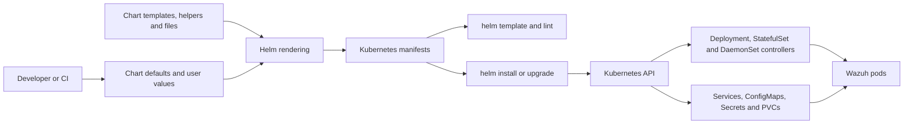
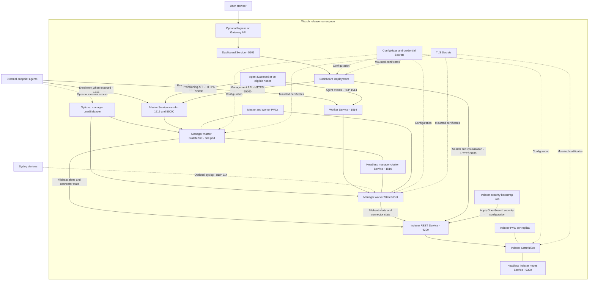
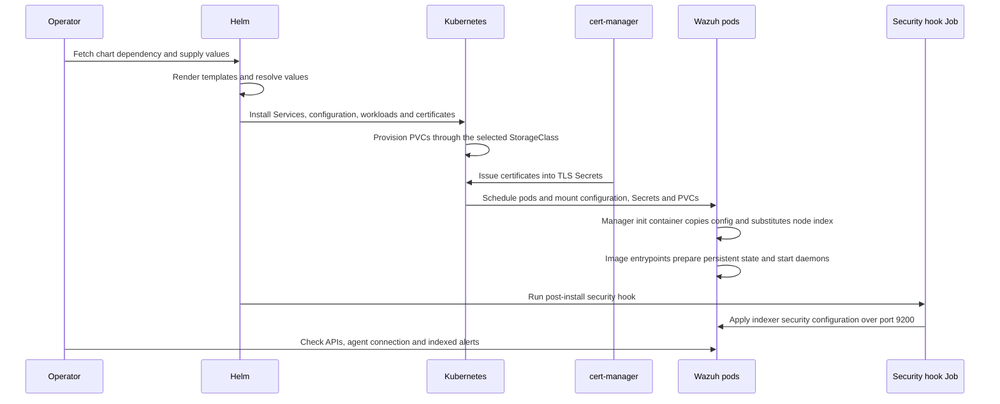
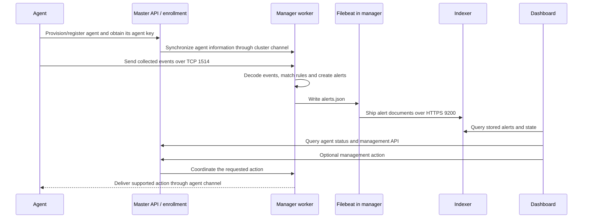
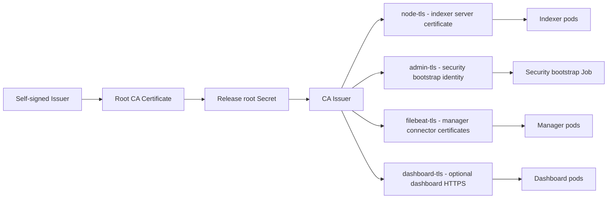
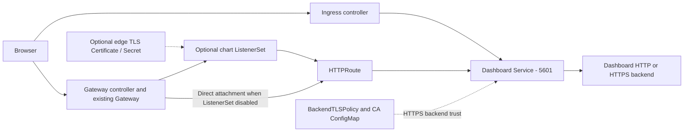
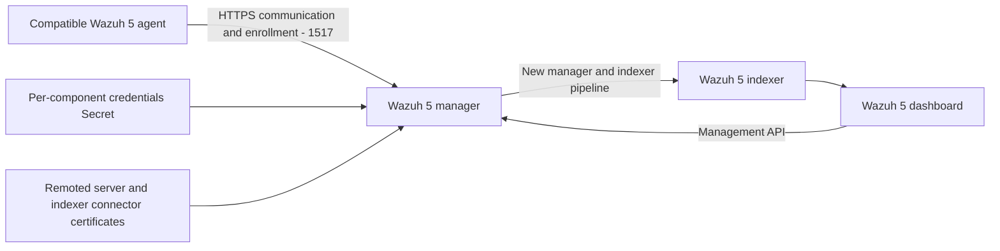

# Wazuh Helm chart architecture and flows

This document describes chart **2.0.7** and its current Wazuh **4.14.3**
manager, indexer and dashboard images. The bundled agent image is
`kinseii/wazuh-agent:4.14.1`. Diagrams show the standard internal-indexer
deployment; optional paths are identified explicitly. Resource names below
assume release `wazuh` without name overrides. Ports are chart defaults.

## 1. What Helm does

Helm combines `charts/wazuh/Chart.yaml`, `values.yaml`, user-supplied values,
templates and helper functions into Kubernetes resources. Helm installs those
resources; Kubernetes schedules pods and maintains their desired state.
The Wazuh containers perform collection, analysis, indexing and visualization.

`helm template` creates YAML without deploying it. `helm lint` checks chart
structure and rendering. Live installation additionally requires Kubernetes,
container images, storage provisioning, certificates and credentials. A
successful render cannot establish that containers start or events get indexed.

## 2. Runtime architecture

Arrows indicate application communication or mounted configuration, not every
individual network connection. ClusterIP Services are internal; the chart does
not make the browser or external-agent paths reachable by itself. Configure
Ingress, Gateway, NodePort, LoadBalancer or another access method as needed.
The optional manager LoadBalancer selects manager pods across node types; its
exposed port list is configurable. The separate master and worker Services
select their respective node types.

| Component | Kubernetes resource | Responsibility | Default scale |
| --- | --- | --- | --- |
| Manager master | StatefulSet | Agent enrollment, management API, cluster coordination and event processing | Exactly one pod |
| Manager workers | StatefulSet | Process agent traffic and synchronize with master | Two replicas |
| Indexer | StatefulSet | OpenSearch storage, search, security and indexer clustering | Three replicas |
| Dashboard | Deployment | Browser UI; queries indexer and manager API | One replica |
| Kubernetes agent | DaemonSet | Collect node information and send events to workers | One pod per eligible node |
| Security bootstrap | Helm hook Job | Apply indexer users, roles and authentication configuration | Runs after install/upgrade |
| cert-manager | Optional subchart or existing installation | Reconcile certificate resources and write TLS Secrets | Disabled as a subchart by default |

The master template fixes replicas to one. StatefulSets give managers and
indexers stable identities and a PVC per pod. Service accounts can be created
by values or supplied separately; the chart defaults to named accounts with
creation disabled, so their existence must be checked before installation.

## 3. Installation and startup flow

PVC provisioning, certificate reconciliation and pod startup happen
asynchronously. Pods can wait for missing volumes or Secrets. With `--wait`,
Helm waits for workload readiness before post-install hooks; readiness checks
must account for the security bootstrap ordering. On upgrade the security Job
runs again, and its default hook policy removes successful Jobs and replaces
an earlier hook Job before creation.

When certificates are enabled, cert-manager CRDs/controllers must already be
available or installed through the dependency. Installing cert-manager
separately first was the workflow tested in the Codex workspace.

## 4. Enrollment, events and dashboard flow

The bundled third-party Kubernetes agent provisions through the manager API
on 55000. Conventional endpoint agents can enroll through authd on 1515 when
that service is reachable and registration settings agree. These are separate
enrollment paths, followed by event communication on 1514.

Managers decode events and evaluate rules. Filebeat runs inside the manager
image; it is not a separate chart Deployment. By default only alerts are
forwarded through its Wazuh module. `wazuh.archives.enabled=true` additionally
enables manager JSON archives and the Filebeat archives fileset, allowing
events that produce no alert to be indexed. Full manager/Filebeat configuration
overrides take precedence and must preserve that behavior themselves.

Wazuh 4 also has an indexer connector for state/inventory and vulnerability
workflows. It does not replace the Filebeat alert path in this chart. The
dashboard uses its backend indexer identity for search and separate manager
API credentials for management. An indexer admin login and the dashboard's
backend service identity are different accounts.

## 5. Certificates and credentials

This diagram shows the chart-created internal CA path. Issuer settings can
alter parts of that path; consult the individual templates when using an
external Issuer. The indexer node certificate specifically references the
chart's CA Issuer. Manager API HTTPS certificates are prepared by the manager
image separately; `filebeat-tls` does not automatically configure API HTTPS.
The live API smoke test trusts the API's local server certificate.

Credential Secrets supply indexer, dashboard, manager API, agent API, authd
and cluster-key settings. Several names, including TLS Secrets, are fixed
rather than release-prefixed, so multiple releases in one namespace can
collide. Use separate namespaces or explicitly supported Secret overrides.
Credential values must agree with indexer password hashes and application
configuration. The chart has demonstration defaults; production installations
need managed credentials and appropriate existing-Secret bindings.

## 6. Storage, configuration and optional access

| Area | How the chart implements it |
| --- | --- |
| Manager persistence | A default 50Gi ReadWriteOnce PVC per master/worker; subpaths hold `/var/ossec` configuration, logs, queue and other state |
| Indexer persistence | A default 50Gi ReadWriteOnce PVC per replica for index data |
| Dashboard | Deployment with configuration/Secret mounts; no default dashboard data PVC |
| Snapshot repository | Optional indexer filesystem snapshot volume; requires suitable shared storage and repository configuration |
| Configuration | Manager and indexer ConfigMaps; indexer security configuration Secret; templated dashboard configuration |
| Rules and agent groups | User rules/decoders and group configuration mounted into managers; init/image startup prepares the final configuration |
| Reloads | Optional `autoreload.enabled` checksum annotations trigger workload rollout when rendered configuration changes; mounted subpath files alone do not guarantee reload |
| Network policy | Templates for indexer, dashboard and managers; actual enforcement requires a supporting CNI |
| Availability | Optional PodDisruptionBudgets, scheduling settings and component resource/probe overrides |

With an external indexer, enable `externalIndexer.enabled`, configure its
endpoint and disable the internal indexer. Ensure credentials and CA trust
match the external service. The chart supports partial deployments through
component flags; validate the resulting cross-component dependencies.

The dashboard has two optional browser-access routes:

Gateway resources require compatible CRDs and a controller; the chart does
not install that infrastructure. Edge TLS and dashboard backend TLS are
separate. OIDC/SAML callback URLs derive from the selected frontend unless
explicitly overridden; direct Gateway attachment requires explicit SSO URLs
when the chart cannot derive the public endpoint. Ingress and Gateway can
coexist. See the [chart values reference](../charts/wazuh/README.md).

## 7. What was verified in the Codex workspace

The disposable Kind cluster used one indexer, one master, one worker and
three 5Gi PVCs. Certificates were issued, volumes bound, master/worker
communication worked, a test agent connected, authenticated API/indexer
checks passed and the dashboard reported green health. A synthetic SSH
failure generated an alert that was found in the indexer. The 66 existing
render assertions also passed.

The local profile reduces queues/thread counts and adds manager readiness
probes. Vulnerability detection is disabled because feed downloads exhausted
memory-backed container storage. Kind's default CNI does not enforce the
rendered NetworkPolicies. The third-party agent disables enrollment TLS
verification and logs tokens/keys; it needs hardening before production use.
These results establish the tested Wazuh 4 workflow, not Wazuh 5 support,
production capacity, vulnerability detection or long-term availability.

Reproduce the profile and checks through [Kind testing](kind-testing.md).
The workspace cluster is temporary and its in-memory image store does not
survive node/workspace replacement.

## 8. Wazuh 5: upstream changes and remaining chart work

As of **8 October 2026**, this investigation targets upstream **5.0.0-rc1**.
Version 5 compatibility is **not implemented in this chart**. The repository
changes so far add test infrastructure and documentation; current image tags,
`appVersion` and production templates still target Wazuh 4.

| Area | Current chart / Wazuh 4 | Upstream Wazuh 5 RC change | Work needed in this chart |
| --- | --- | --- | --- |
| Manager filesystem | `/var/ossec`, `ossec.conf`, `wazuh` user | `/var/wazuh-manager`, `wazuh-manager.conf`, `wazuh-manager` user | Update mounts, subpaths, config generation, lifecycle commands and permissions |
| Manager control | `/var/ossec/bin/wazuh-control` | `/var/wazuh-manager/bin/wazuh-manager-control` | Update probes, operational commands and smoke checks |
| Agent protocol | Events on 1514; authd enrollment on 1515 | New agent HTTPS communication/enrollment channel on 1517 | Add Services, ports, policy rules and compatible enrollment; test legacy agent behavior separately |
| Forwarding | Filebeat alert/archive pipeline plus state connector | Upstream manager uses the new manager/indexer pipeline and configuration | Replace Filebeat assumptions after verifying alert, archive and inventory paths end to end |
| Manager environment | Current API/indexer image variables and templated XML | `WAZUH_INDEXER_HOSTS`, node type/name, cluster nodes/key and bind-address settings | Map values to the new entrypoint behavior and manager configuration |
| Credentials | Chart demonstration passwords and OpenSearch bcrypt hashes | Per-component `/run/secrets/wazuh-credentials` files; no shipped passwords | Add matching Secret formats and first-start/rotation behavior; verify dashboard and manager identities |
| Manager TLS | Filebeat certificate paths under `/etc/ssl` | Indexer connector and remoted server certificates under manager `etc/certs` | Generate appropriate client/server certificates, SANs, mounts and trust chains |
| Indexer/dashboard | 4.14.3 configuration and security bootstrap | RC images have changed credential and startup contracts | Compare configuration, storage, hooks and health probes with upstream RC manifests |
| Kubernetes agent | Third-party 4.14.1 image and Wazuh 4 provisioning | Requires a Wazuh 5-compatible agent and HTTPS enrollment | Select/verify an image and test enrollment plus event delivery |
| Existing data | Wazuh 4 PVC layout and stored credentials | New paths and initialization contracts | Develop and validate an explicit migration/backup plan; begin RC tests with fresh PVCs |

Some upstream RC examples retain ports 1514/1515 as well as 1517. That is not
proof every existing agent/configuration is compatible. Changing image tags
alone cannot update the chart's filesystem, credential and transport contracts.
Exact migration and compatibility behavior must be verified against the target
release; RC details may change before general availability.

The intended Wazuh 5 flow to validate is:

This is a proposed compatibility target, not an already deployed architecture.
Implementation should cover manager paths/configuration first, then credentials
and TLS, Services/policies and agent enrollment, and finally event/state flow,
dashboard operation, restart persistence and migration tests. Preserve Wazuh 4
behavior with regression checks or explicitly version the breaking chart change.

Upstream evidence used for the comparison:

- [Wazuh Kubernetes RC manifests](https://github.com/wazuh/wazuh-kubernetes/tree/b85e6869db2db81e77fb2a302a887c03a4db7fe0).
- [Wazuh Docker RC images and entrypoints](https://github.com/wazuh/wazuh-docker/tree/29a8d75c7fe8fe54fde1c4dba4fa6a9e22d29548).
- [Upstream RC credential contract](https://github.com/wazuh/wazuh-docker/blob/29a8d75c7fe8fe54fde1c4dba4fa6a9e22d29548/docs/ref/credentials.md).
- [Repository Wazuh 5 testing checklist](wazuh-5-testing.md).

## 9. Source map

| Subject | Repository source |
| --- | --- |
| Versions and dependency | [`Chart.yaml`](../charts/wazuh/Chart.yaml) |
| Defaults and feature switches | [`values.yaml`](../charts/wazuh/values.yaml) |
| Naming, dashboard and configuration helpers | [`templates`](../charts/wazuh/templates) |
| Manager workloads and configuration | [`templates/manager`](../charts/wazuh/templates/manager), [`_ossec_conf.tpl`](../charts/wazuh/templates/_ossec_conf.tpl) |
| Indexer workloads, Services, security Job and snapshots | [`templates/indexer`](../charts/wazuh/templates/indexer) |
| Dashboard, Ingress, Gateway and SSO configuration | [`templates/dashboard`](../charts/wazuh/templates/dashboard) |
| Agent resources | [`templates/agent`](../charts/wazuh/templates/agent) |
| Internal certificates and issuers | [`templates/certs`](../charts/wazuh/templates/certs) |
| Archives/Filebeat rendering | [`_filebeat_config.tpl`](../charts/wazuh/templates/_filebeat_config.tpl) |
| Render regressions | [`render_test.sh`](../charts/wazuh/tests/render_test.sh) |
| Local deployment profile and functional checks | [`scripts`](../scripts) |
